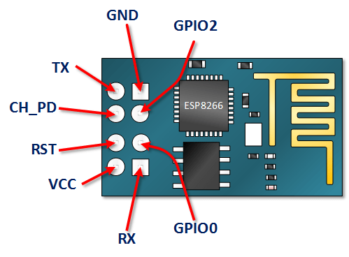

# ESP8266 (ESP-01) Wifi Relay Project
The idea is to have a 220V outlet controllable (turned ON or OFF) over the Internet.

## Block Diagram
**TODO:** Add here the block diagram.

## ESP-01 Pinout

## ESP-01 Wifi Relay Schematic

## ESP-01 Wifi Relay Layout

## Controlling the Relay
**GPIO2** from the ESP-01 pinout must be soldered directly to **R3** (bypassing output P3.2 of U4) for the
relay module to be controlled directly over ESP8266.

## ESP-01 Web Server
https://create.arduino.cc/projecthub/ROBINTHOMAS/esp8266-esp-01-webserver-7248ca

## Correct Boot-Up for Flash Download of New Firmware
1. Pull-down **GPIO0** to GND then toggle **RESET PIN** or do a **POWER CYCLE** of the board to enable flash downloading.
